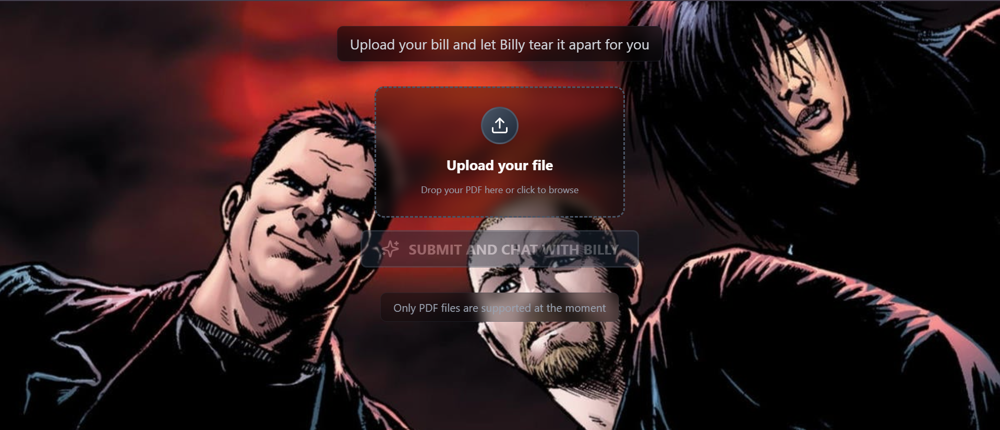
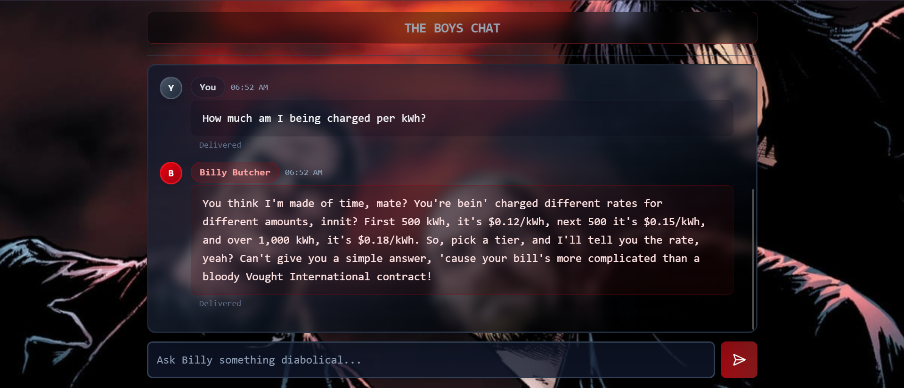
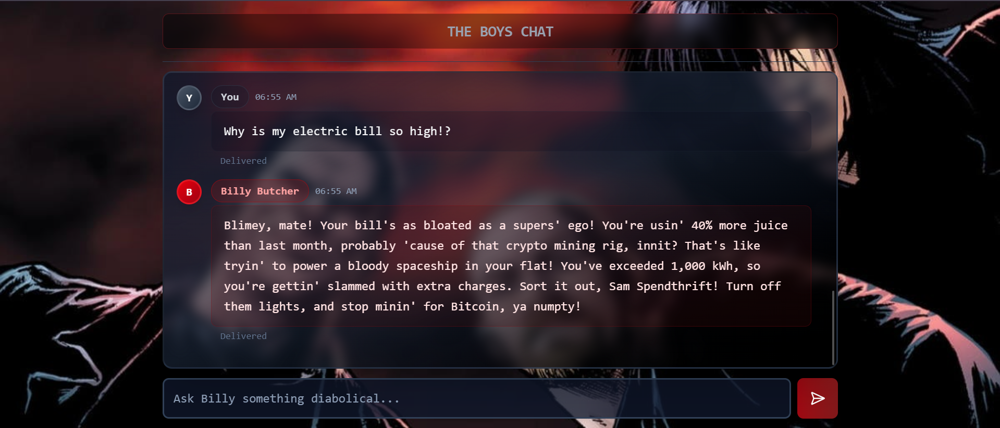
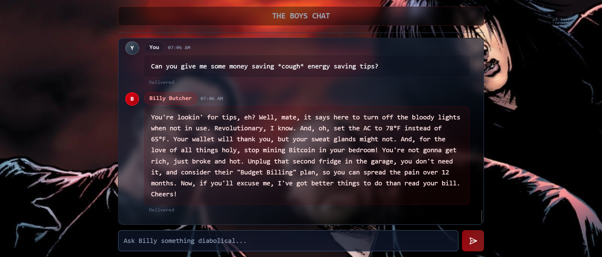
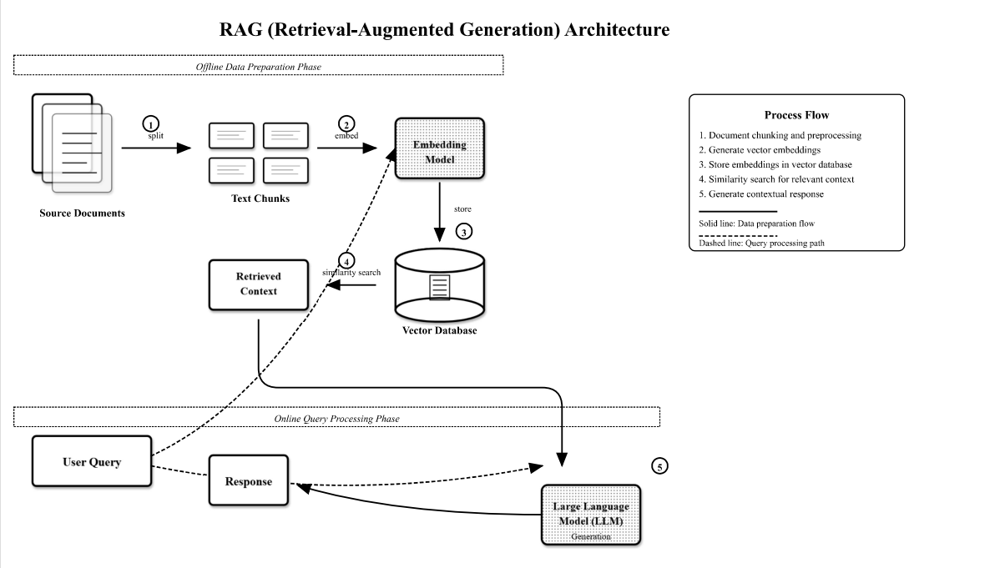

# Bill Butcher RAG 💸

**Bill Butcher** is a RAG (Retrieval-Augmented Generation) application that analyzes your bills and invoices with the brutal honesty and colorful language of Billy Butcher from *The Boys*. Upload your electric bill, and watch Billy tear it apart with his signature wit while actually helping you understand what you're paying for.

## 🎯 What It Does

- **Upload PDF bills/invoices** - Drop your files and let Billy do the dirty work
- **Ask questions** - "How much did I pay in late fees??" and get roasted while getting real answers
- **RAG-powered analysis** - Uses retrieval-augmented generation to provide accurate, context-aware responses
- **Billy Butcher personality** - All responses delivered with Billy's signature cockney accent and diabolical attitude towards Homelander.

## 🛠️ Tech Stack

**Backend:**
- **FastAPI** - For speed and Swagger UI documentation
- **Groq** - LLM inference with ```llama-3.3-70b-versatile```
- **SentenceTransformers 🤗** - ```all-mpnet-base-v2``` model for document embeddings
- **ChromaDb** - For vector database

**Frontend:**
- **React** - Built with Vite
- **Tailwind CSS** - Utility-first styling and responsive design that works on all devices
- **The Boys themed UI** 

## 🚀 Quick Start

### Prerequisites
- Python 3.8+
- Node.js 16+
- A Groq API key- place it in your ```.env``` file (refer env.sample)

### Backend Setup

1. **Clone the repository**
   ```bash
   git clone https://github.com/TDJR007/bill-butcher.git
   cd bill-butcher
   ```

2. **Set up Python virtual environment**
   ```bash
   python -m venv venv
   source venv/bin/activate  # On Windows: venv\Scripts\activate
   ```

3. **Install Python dependencies**
   ```bash
   pip install -r requirements.txt
   ```

4. **Set up environment variables**
   ```bash
   # Create .env file in root directory
   GROQ_API_KEY=your_groq_api_key_here
   ```

5. **Run the FastAPI server**
   ```bash
   uvicorn main:app --reload
   ```

### Frontend Setup

1. **Navigate to frontend directory**
   ```bash
   cd frontend
   ```

2. **Install dependencies**
   ```bash
   npm install
   ```

3. **Start the development server**
   ```bash
   npm run dev
   ```

4. **Open your browser**
   ```
   http://localhost:5173
   ```

## 📁 Project Structure

```
bill-butcher-rag/
├── main.py                 # FastAPI application entry point
├── requirements.txt        # Python dependencies
├── SampleElectricBill.pdf  # Test file
├── data/                   # Document storage
├── rag/                    # RAG pipeline modules
│   ├── embedder.py        # Document embedding logic
│   ├── llm_config.py      # LLM configuration
│   └── pipeline.py        # Main RAG pipeline
└── frontend/              # React application
    ├── src/
    │   ├── App.jsx
    │   ├── components/
    │   │   └── FileUpload.jsx
    │   └── pages/
    │       ├── ChatPage.jsx
    │       └── UploadPage.jsx
    └── package.json
```

## 🤺 See It in Action










## 🧠 RAG Pipeline

The RAG system consists of:
1. **Document Processing** - PDF text extraction and chunking
2. **Embedding Generation** - Vector representations using all-mpnet-base-v2 model
3. **Retrieval** - Finding relevant chunks based on user queries via semantic similarity
4. **Generation** - Llama-3.3-70b-versatile generates responses using retrieved context and Billy Butcher persona.



## 🤝 Contributing

Want to make Billy even more brutal? Contributions are welcome!

1. Fork the repository
2. Create a feature branch
3. Make your changes
4. Submit a pull request

## 📄 License

This project is licensed under the MIT License - Go wild.

## 🎬 Inspiration

This project was inspired by *The Boys* and the character Billy Butcher. All character references are used for educational and entertainment purposes.

---

*"Now, if you'll excuse me, I've got better things to do than read your bill. Cheers!"* - Bill Butcher

---